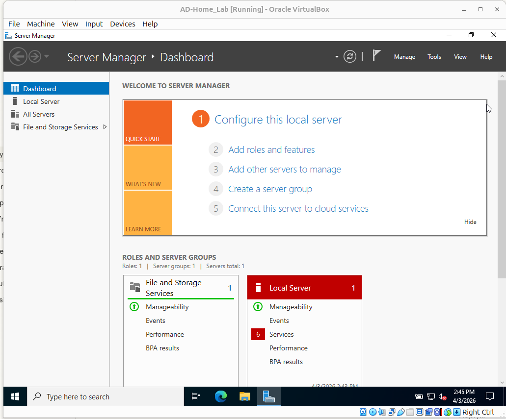
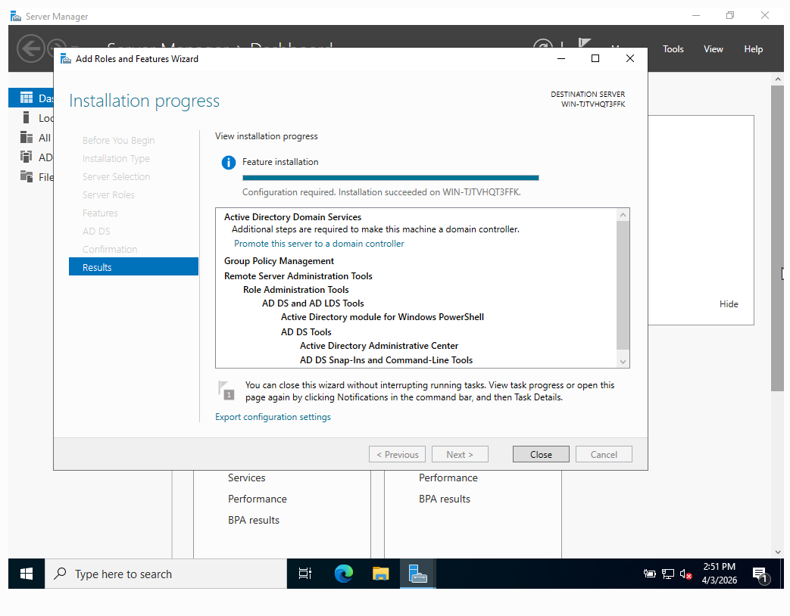
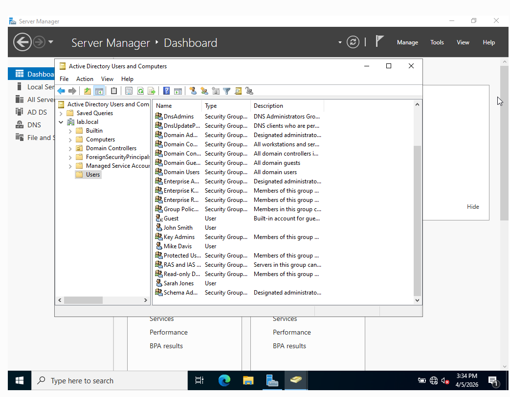
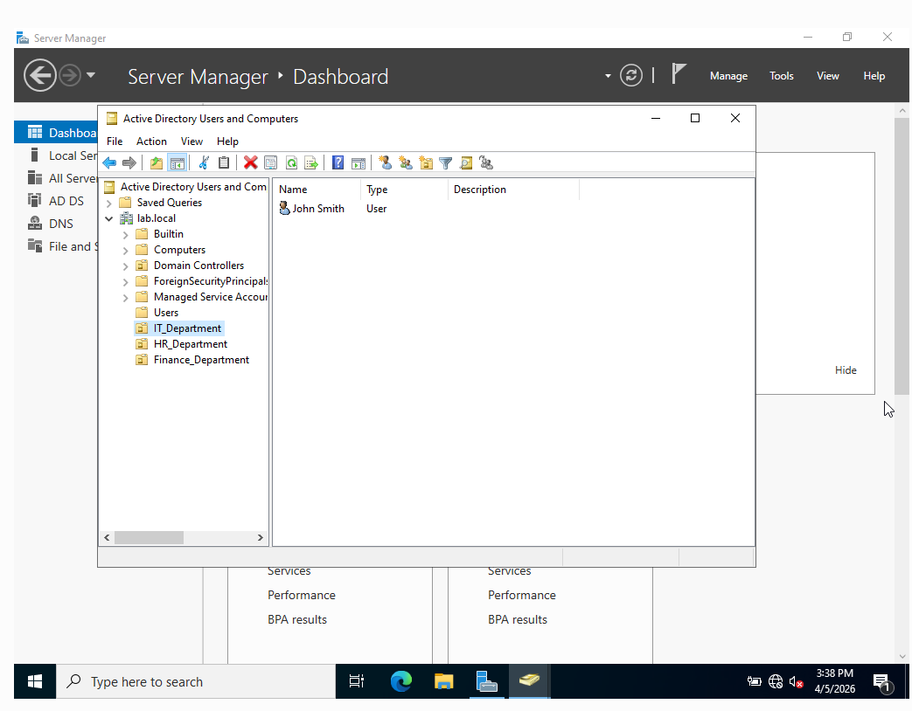
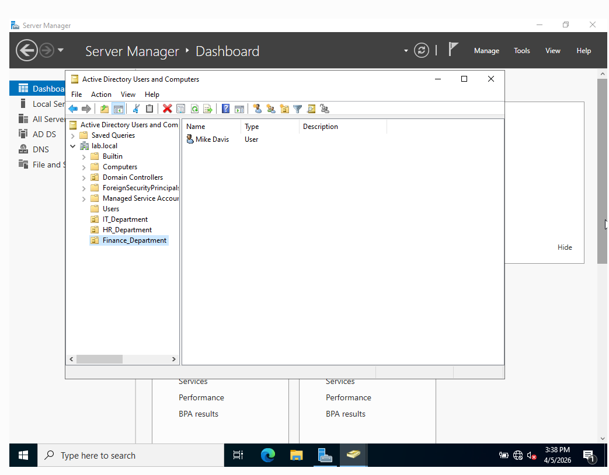
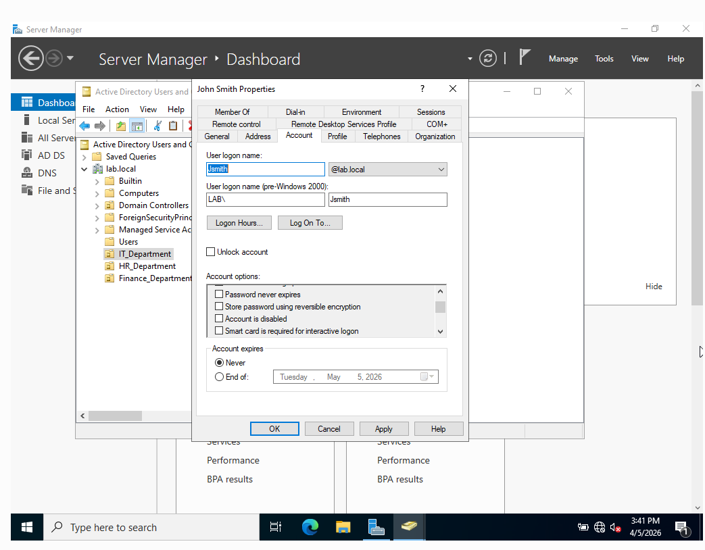
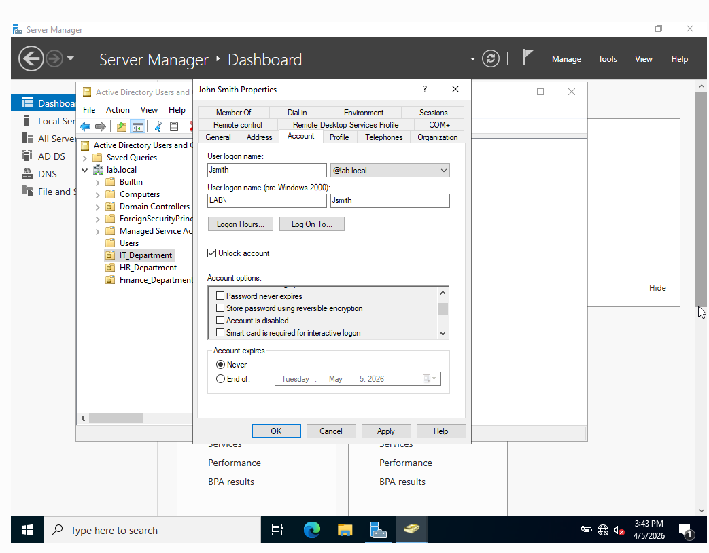
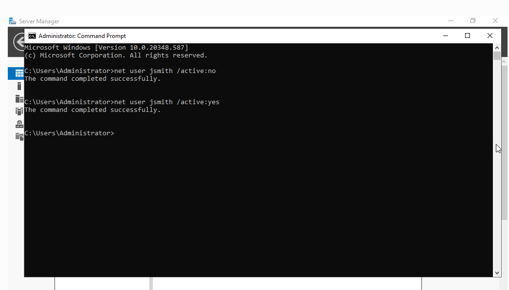
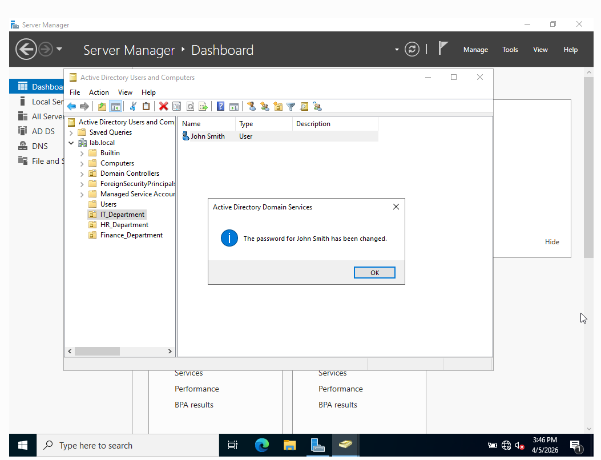
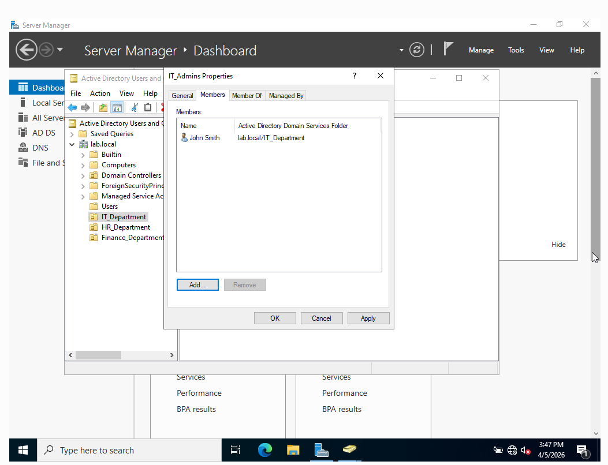

# Active Directory Home Lab — In Progress. Windows Server VM lab covering user creation, permissions, and lockout recovery. Documentation coming soon.

Hands-on Active Directory lab built to demonstrate user 
provisioning, group management, account lockouts, password 
resets, and MFA simulation in a Windows Server environment.

## Why I Built This
Active Directory appears in nearly every help desk and IT 
support JD. Built this lab to show I can do it, not just 
list it.

## What It Covers
- Windows Server VM setup and AD installation
- User creation, group assignment, and permission management
- Account lockout simulation and recovery
- Password reset workflows
- MFA configuration

## Skills
Active Directory · Windows Server · IAM · User Provisioning · 
Group Policy · Identity Management

### Completed Steps
- Windows Server 2022 installed in VirtualBox
- Active Directory Domain Services role installed
- Server promoted to Domain Controller (lab.local)
- Created 3 users: jsmith, sjones, mdavis
- Created 3 Organizational Units: IT, HR, Finance
- Simulated account lockout and recovery
- Performed password reset with forced change on next login
- Created IT_Admins security group

## Screenshots

### Windows Server 2022 Installed

### Active Directory Role Installed

### Users Created in Active Directory

### Organizational Units

### Account Lockout Simulation

### Password Reset

### Security Group

## Links
- LinkedIn: https://www.linkedin.com/in/kris-stokes-it/
